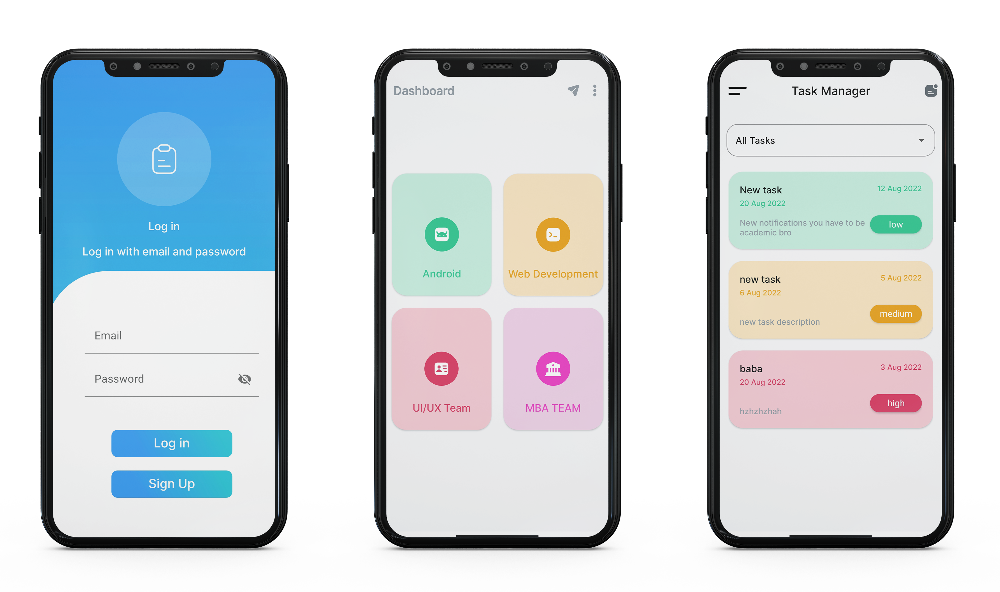
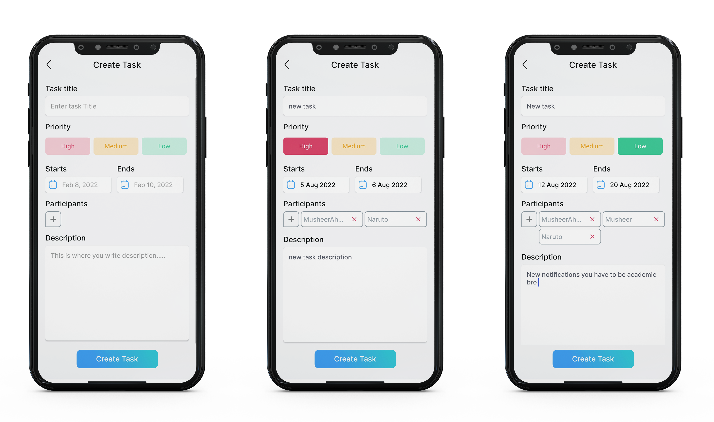
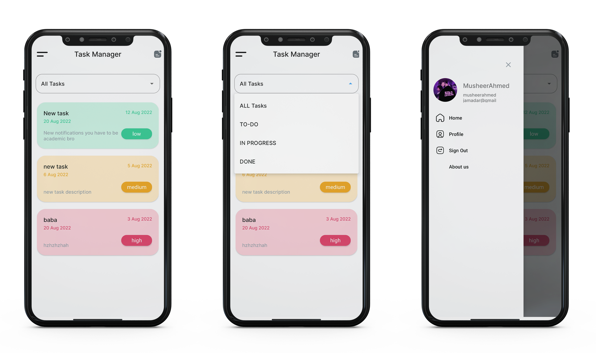
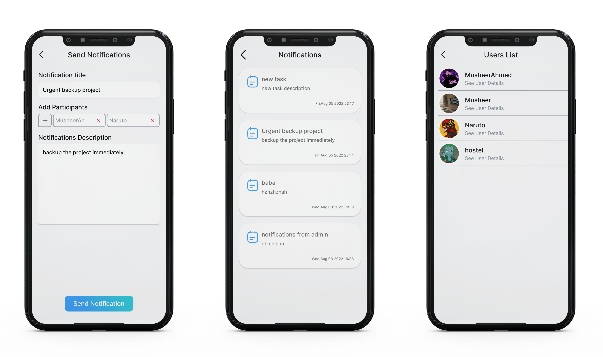
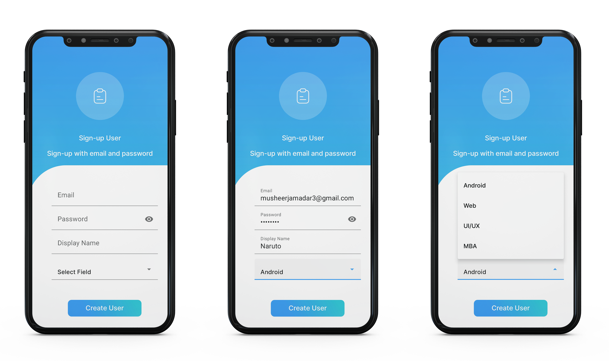
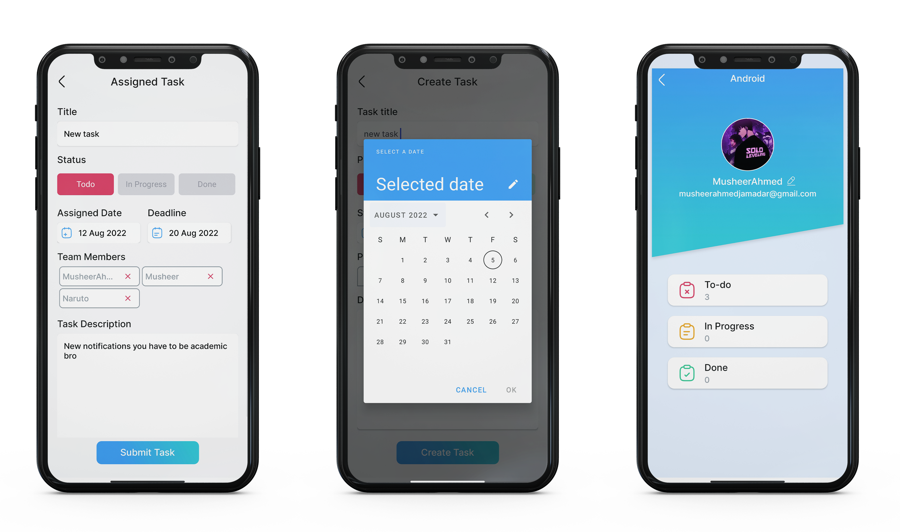

 
  

&#xa0;

  <!-- <a href="https://e_commerce_app_flutter.netlify.app">Demo</a> -->

<h1 align="center">TasksApp</h1>

## Status

<h4 align="center">
TasksApp Completed
</h4>

  <a href="#dart-about">About</a> &#xa0; | &#xa0; 
  <a href="#sparkles-admin-features">Features</a> &#xa0; | &#xa0;
  <a href="#checkered_flag-illustrations">Illustrations</a> &#xa0; | &#xa0;
  <a href="https://github.com/MusheerJ" target="_blank">Author</a>

 

## :dart: About

This is a Team-Tasks Management Application developed using AndroidFire(Android+Firebase). This Application is specially developed for managing and monitoring team-tasks.
## :sparkles: Admin-Features

:heavy_check_mark: Admin Authentication\
:heavy_check_mark: Password Resetting\
:heavy_check_mark: Admin dashboard\
:heavy_check_mark: Assign task to users/teams\
:heavy_check_mark: Edit assigned task\
:heavy_check_mark: Send notifications to users/teams

## :sparkles: User-Features

:heavy_check_mark: User Authentication\
:heavy_check_mark: Password Resetting\
:heavy_check_mark: User login\
:heavy_check_mark: User tasks\
:heavy_check_mark: Navigation drawer\
:heavy_check_mark: Submit task to admin with status\
:heavy_check_mark: User profile\
:heavy_check_mark: Edit User Profile\
:heavy_check_mark: Tasks stats

## :checkered_flag: Illustrations

Here are some Illustration of App Screens

|  |
| :--------------------------------:| 
|            Login         |

|  |
| :--------------------------------:| 
|            Create Task         |

|  |
| :--------------------------------:| 
|            Home         |

|  |
| :--------------------------------:| 
|            Notifications         |

|  |
| :--------------------------------:| 
|            User Profile         |

|  |
| :--------------------------------:| 
|            Sign up         |

|  |
| :--------------------------------:| 
|            View Task         |

